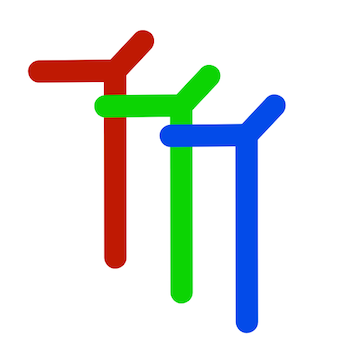

# ThereThenThat
Alpha 4 (Doppio) - December 18, 2017



## Crowdsourced search by Location, Time, and Tags

## Overview

ThereThenThat is like a scrapbook for media and links.

ThereThenThat enables searching through time, space, and/or keyword.  Collections can be easily shared in a consistently formatted link.

It has elements of Imgur, or Flickr, or a Blog...
Check out: https://medium.com/@javajoint/therethenthat-mapping-web-addresses-to-location-time-and-tags-december-20-2017-copyright-2003-6df810a0e49a

Historical Note:
I originally wrote this idea up in 2003-2005:
* https://web.archive.org/web/20030418025743/http://thereandthen.org:80/
* https://web.archive.org/web/20050403204849/http://thereandthen.org:80/

Release Note for Alpha 4 (Doppio):

* migrating to a mixin
* better support for drag/drop of links to other pages

Tag View is not stable.  There is no collection to paste or drag to in that mode.  The idea will be to create a "collection by the day" to handle all new media.  The goal is:

* when looking at a collection, new media/links will go to that collection + a collection for that day
* when looking at tag view, new media/links will go to a collection for that day


### Features

* Search for collections by Location, Time, and/or Tags
* Drag and Drop links to web pages...
* Drag and Drop image, audio(mp3), and video(mp4) files into it...
* instant previews and auto-upload
* tag individual items

Users start a collection that expresses some “where, when, what” concept, and fill it with references and media that relate to that.  Think of something such as:

_"New York City, November 2017, CentralPark, Parade"_


A simpler form of this project is my work on [SnapperStore](https://github.com/DanielSmith/snapperstore) -- it sticks to tags for individual  items, and groups items by date uploaded.

## Build Setup

After cloning the repository, you will see this top level directory structure:


```
ThereThenThat
├── ThereThenThat-client
│   ├── build
│   ├── config
│   ├── src
│   │   ├── assets
│   │   ├── components
│   │   ├── router
│   │   ├── store
│   │   └── stylus
│   ├── static
│   └── test
│       └── unit
│           └── specs
├── ThereThenThat-server
│   └── models
└── common

```


### Server Side
```
cd ThereThenThat-server
```


The configuration for the server is kept in config.json:

``` bash
{
  "MONGO_DB_HOST": "mongo host",
  "MONGO_DB_CONNECT": "mongodb://localhost/mytttapp",
  "SERVER_ADDRESS": "http://localhost:3100",
  "SERVER_PORT": "3100",
  "CLIENT_ADDRESS": "http://localhost:8080"
}
```

These defaults should be fine for a local development environment.  If you want to change the default collection name (from "nytttapp"), do so in MONGO_DB_CONNECT.

``` bash
# install dependencies
npm install

# Node process will run at port 8081
npm run server
```

You should be running a recent version of MongoDB.  Here is what I am using at the moment:

```bash
Brooklyn:projects dls$ mongo --version
MongoDB shell version v3.4.4
git version: 888390515874a9debd1b6c5d36559ca86b44babd
OpenSSL version: OpenSSL 1.0.2l  25 May 2017
allocator: system
modules: none
build environment:
    distarch: x86_64
    target_arch: x86_64
```

### Client Side

```
cd ThereThenThat-client
```

The configuration for the client is kept in src/config.js:

``` bash
const configs = {
  ENV: 'Local Dev',
  CLIENT: 'http://localhost:8080',
  SERVER: 'http://localhost',
  SERVER_PORT: ':3100'  
}
```

You will need your own Google API key to use Google Maps.  In index.html, Change "YOUR_GOOGLE_MAPS_API_KEY" to your key:

```
<script async defer type="text/javascript"
src="https://maps.googleapis.com/maps/api/js?key=YOUR_GOOGLE_API_KEY&libraries=places">
</script>
```

For more information on how to get a Google Maps API key, go to: https://developers.google.com/maps/documentation/javascript/get-api-key

```
# install dependencies
npm install

# serve with hot reload at localhost:8080
npm run dev
```


### Getting Started

Once the client and server sides are running, you will see a mostly empty page at http://localhost:8080/

Create a collection by clicking in any of the text fields up at the top of the page: Location, Time, or Tags.  You can change any of the fields, and then press the "Create" button to create a collection.  From that point, you are taken to your new collection +(which will be empty).  You can now add links or media to that collection.  Try to drag and drop an image from your local machine. [need to make this render with the tag functionality right away.. for now, refresh the page]

### Tags

Tags can be used to direct search (find all items with same tag)

**Editing Tags**

Clicking on the pencil button for any item will allow you to add and remove tags.


## Some Notes

### Article: Deploy on Digital Ocean

(this is on hold until a couple of bugs are addressed)

### Repo & Article: SnapperStore on Digital Ocean

My companion project to ThereThenThat is SnapperStore.  It has a different focus.

* Github: https://github.com/DanielSmith/snapperstore
* Medium Post: https://medium.com/@javajoint/deploying-snapperstore-with-digital-ocean-949280312fa

### A few notes on dependencies:

There will be a future document about the architecture of ThereThenThat.  In broad strokes, the server side is a headless CMS, and the dev client runs in a completely seperate Node/Webpack/Vue.js environment. There is also a dependency on having a working MongoDB instance.

* Client - Vue.js, Vuetify, Vuex, Google Maps API
* Server - Node.js, Express, Multer, Mongoose, MongoDB
